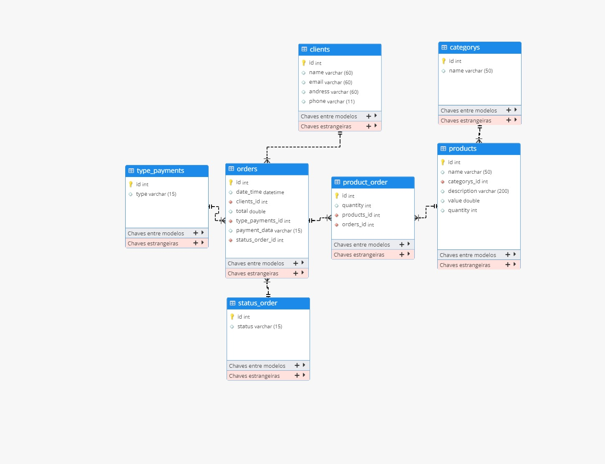

## Ecommerce
[](https://github.com/aarrieche/java-challenge-03-compass/edit/main/README.md) 

## Sobre o projeto

Ecommerce  é uma aplicação back end construída durante o terceiro desafio da trilha um evento organizado pela "CompassUol".
A aplicação consiste nas seguintes classes: Product ,Category, Clients, Type_Payments , Orders, Product_Order e Status_Order. Nesta fase do projeto, iremos trabalhar somente
com as classes Category e Products, onde o crud completo para cada dominio de produto vamos criar,ler,alterar e excluir dados. Configurar um banco de dados e realizar tratamento de exceções.

##Layout


## Modelo conceitual



# Tecnologias utilizadas
## Back end
- Java
- JPA / Hibernate
- Maven

## Implantação em produção
- Banco de dados: Postgresql

# Como executar o projeto

## Back end
Pré-requisitos: Java 11

```bash
# clonar repositório
git clone https://github.com/Pablo9293

# entrar na pasta do projeto back end
cd backend

# executar o projeto
.Java
```


```bash
# clonar repositório
git clone https://github.com/Pablo9293


# instalar dependências
yarn install# exemploReadme

## Autores:
Alexandre Arrieche
Rafael Lucena
Pablo Cupertino
